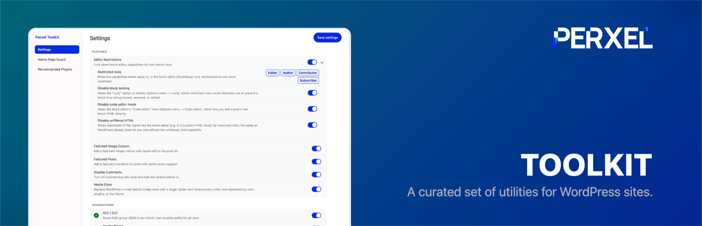
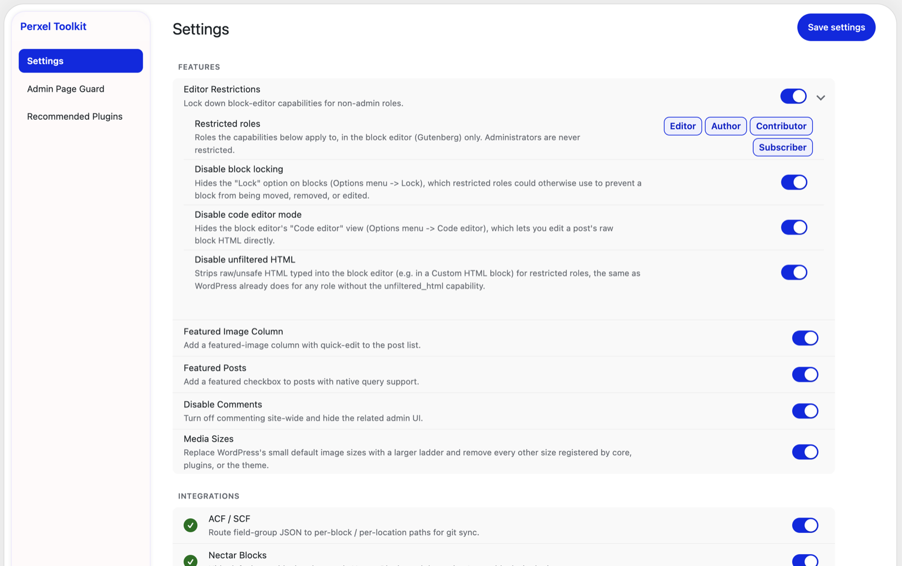
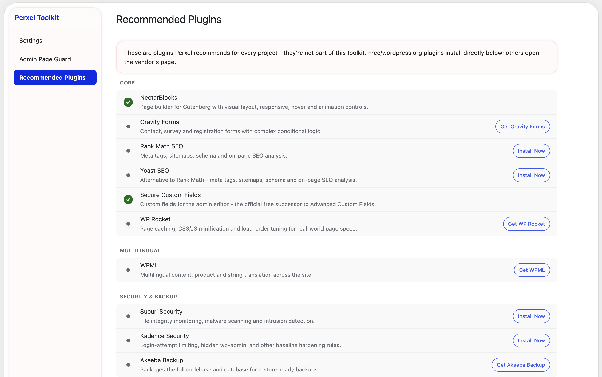
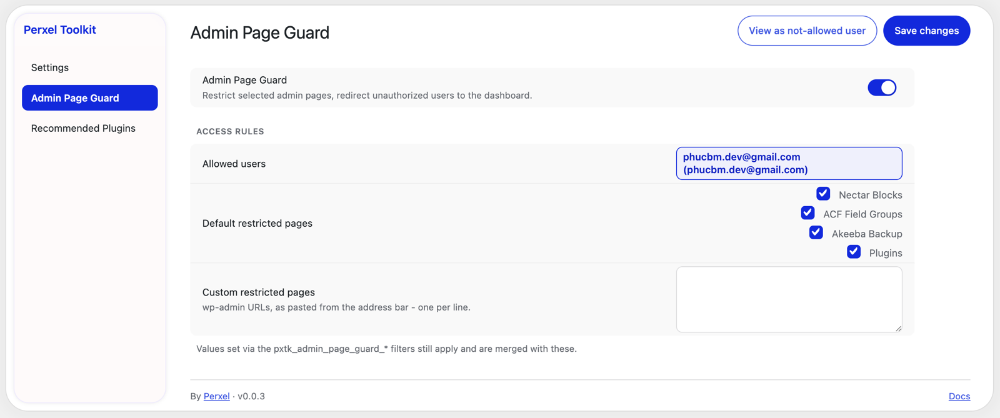

# Perxel Toolkit

Small admin and block-editor features plus integrations for popular plugins,
behind one settings screen at **Tools -> Perxel Toolkit**. Every module is
**on after activation** - switch off the ones a site doesn't need.

**Features**

- **Editor Restrictions** - hide block locking, the code editor and unfiltered
  HTML in the block editor for the roles you choose (administrators are never
  restricted).
- **Featured Image Column** - a featured-image column on the post list; click
  it to set or change the image.
- **Featured Posts** - a "Featured" checkbox on posts (edit screen and Quick
  Edit), stored as post meta you can query.
- **Disable Comments** - close and hide comments site-wide and remove the
  related admin UI. Existing comments are kept.
- **Media Sizes** - a larger default image-size ladder, with every other
  registered size removed.

**Access control**

- **Admin Page Guard** - hide selected admin pages from the menu and redirect
  everyone except the users you allow, with a "View as not-allowed user"
  preview. Restricts nothing if the allowed-users list is emptied.

**Integrations** (listed once the plugin they extend is active)

- **Gravity Forms** - render the same form more than once on a page.
- **ACF / Secure Custom Fields** - save field-group JSON next to each block, or
  to per-location files in the theme.
- **Nectar Blocks** - hide the default core blocks from the inserter.

A **Recommended Plugins** screen lists plugins that pair well with the toolkit.
Nothing is installed unless you click install.

## Screenshots

## Install

1. Copy this folder to `wp-content/plugins/perxel-toolkit/` (or install the
   release zip from GitHub Releases).
2. Activate **Perxel Toolkit** on the Plugins screen.
3. Go to **Tools -> Perxel Toolkit** and turn on the modules you want.

## Requirements

- WordPress 6.5+
- PHP 7.4+

## Data and external services

- Stores its settings in one option, `pxtk_settings`, removed when the plugin
  is deleted.
- Featured Posts stores a `_featured` post meta flag; Media Sizes updates the
  core image-size values under Settings -> Media. Both are left in place on
  delete.
- Makes no requests to external services.

## License

GPL-2.0-or-later. See [LICENSE](LICENSE).
